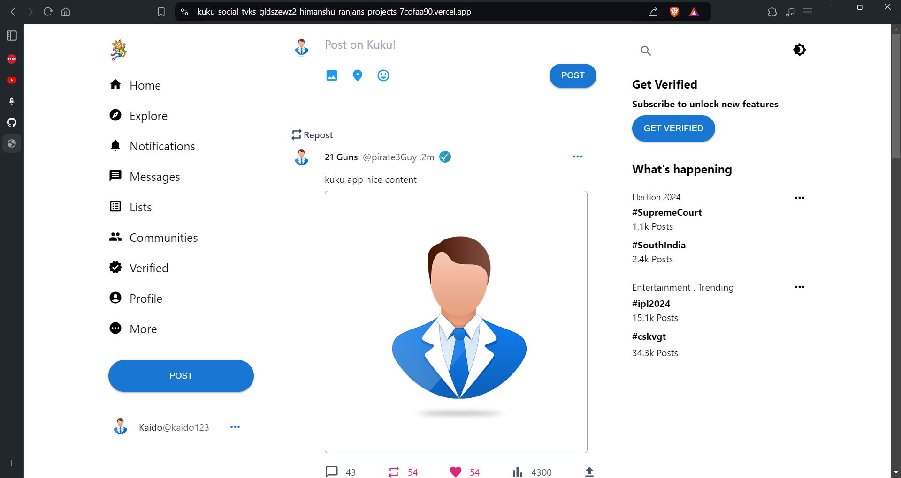

# Kuku-Social

Kuku-Social is a full-stack social media web application developed using React.js for the front end and Springboot for the back end. The application allows users to create accounts, post updates, interact with other users' posts through likes and comments, and follow other users to see their updates in a personal feed.

## Table of Contents

- [Features](#features)
- [Screenshots](#screenshots)
- [Installation](#installation)

## Features

- **User Authentication**: Sign up and log in.
- **User Profiles**: Create and customize user profiles.
- **Post Updates**: Share text updates with other users.
- **Likes and Comments**: Interact with posts through likes and comments.
- **Follow System**: Follow other users to see their posts in your feed.
- **Real-time Updates**: Real-time updates.

## Screenshots


_Login Page_


_Feed Page_


_Profile Page_

## Installation

To get a local copy up and running, follow these steps:

1. **Clone the repository**
   ```sh
   git clone https://github.com/himanshu3232/Kuku-Social.git
   cd Kuku-Social
   ```
2. **Install dependencies**

```sh
npm install
```

3. **Start the development server**

```sh
npm run dev
```
